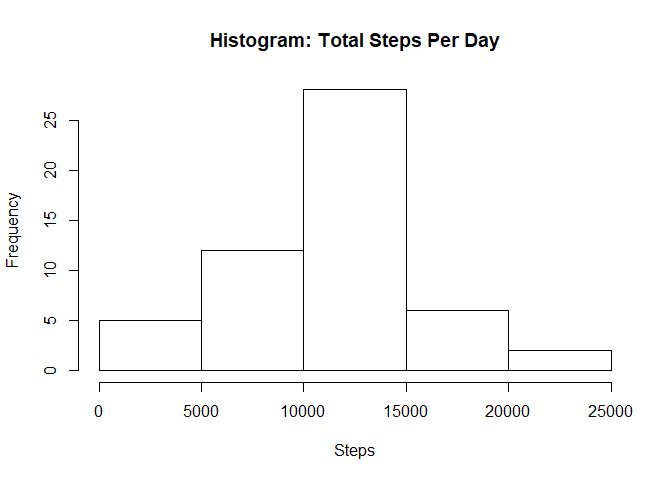
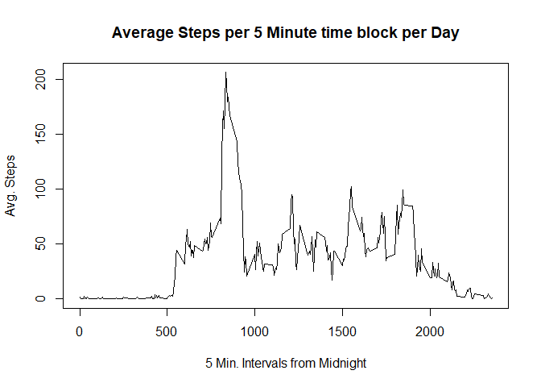
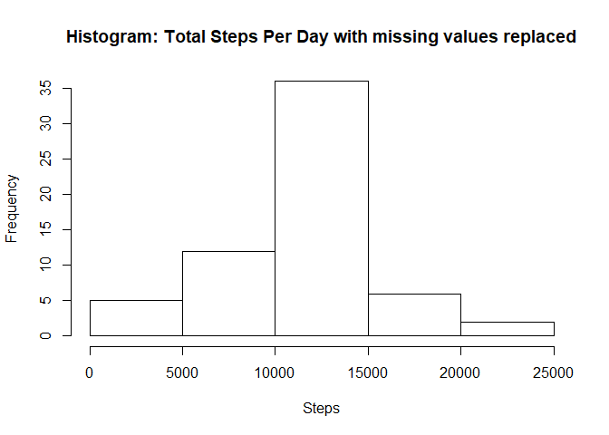
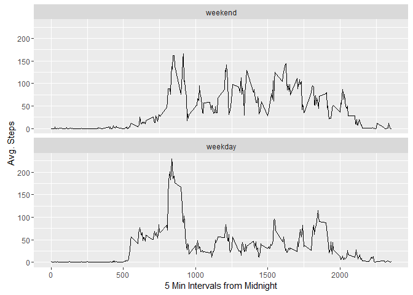

# Reproducible Research: Peer Assessment 1


## Loading and preprocessing the data


Load required libraries

```r
library(dplyr)
library(ggplot2)
```

Load data, set up summary data by date and interval to use in the analysis

```r
d <- read.csv("activity/activity.csv", stringsAsFactors = FALSE)
dailySteps <- summarize(group_by(d, date), totalSteps = sum(steps))
intervalSteps <- summarize(group_by(d, interval), avgSteps = mean(steps, na.rm = TRUE))
```

## What is mean total number of steps taken per day?


```r
hist(dailySteps$totalSteps, main = "Histogram: Total Steps Per Day", xlab = "Steps")
```

<!-- -->

A look at the statistis for the average daily steps data

```r
summary(dailySteps)
```

```
##      date             totalSteps   
##  Length:61          Min.   :   41  
##  Class :character   1st Qu.: 8841  
##  Mode  :character   Median :10765  
##                     Mean   :10766  
##                     3rd Qu.:13294  
##                     Max.   :21194  
##                     NA's   :8
```


## What is the average daily activity pattern?

Now we will look at the average steps taken in each 5 minute time slice over the course of a day

```r
plot(intervalSteps, type = "l", ylab = "Avg. Steps", xlab = "5 Min. Intervals from Midnight", main = "Average Steps per 5 Minute time block per Day")
```

<!-- -->

Calculate the time block that has the most average steps

```r
intervalSteps[which.max(intervalSteps$avgSteps),]
```

```
## # A tibble: 1 × 2
##   interval avgSteps
##      <int>    <dbl>
## 1      835 206.1698
```

## Imputing missing values

Calculate the number of NA records in the dataset

```r
count(d[is.na(d$steps),])
```

```
## # A tibble: 1 × 1
##       n
##   <int>
## 1  2304
```

For records with missing data, we will use the average value for that interval

```r
d_noNA <- merge(d, intervalSteps, by.x = "interval", by.y = "interval")
d_noNA <- mutate(d_noNA, steps = ifelse(is.na(steps), avgSteps, steps))
d_noNA <- mutate(d_noNA, avgSteps = NULL)
dailyStepsNoNA <- summarize(group_by(d_noNA, date), totalSteps = sum(steps))
```

Show the average daily steps histogram again, this time with missing values replaced with means

```r
hist(dailyStepsNoNA$totalSteps, main = "Histogram: Total Steps Per Day with missing values replaced", xlab = "Steps")
```

<!-- -->

Recalculate statistics on the average daily steps data with missing values replaced with means

```r
summary(dailyStepsNoNA)
```

```
##      date             totalSteps   
##  Length:61          Min.   :   41  
##  Class :character   1st Qu.: 9819  
##  Mode  :character   Median :10766  
##                     Mean   :10766  
##                     3rd Qu.:12811  
##                     Max.   :21194
```

As you can see, replacing missing values with the time slice average value has little impact on the mean and median.
It does adjust the distribution of values, however, as you can see from the differences in the quantiles.


## Are there differences in activity patterns between weekdays and weekends?


Now we will investigate whether there is a difference in pattern activity on weekends.
First we will create a factor with weekend and weekday levels


```r
d_noNA$date <- as.Date(d_noNA$date)
d_noNA$DayType <- factor((weekdays(d_noNA$date) %in% c('Saturday','Sunday')), levels = c(TRUE,FALSE), labels= c('weekend','weekday'))
intervalStepsNoNA <- summarize(group_by(d_noNA, interval, DayType), avgSteps = mean(steps))
```


```r
ggplot(data = intervalStepsNoNA, aes(x = interval, y = avgSteps)) + geom_line() + facet_wrap(~ DayType, ncol = 1) + ylab("Avg. Steps") + xlab("5 Min Intervals from Midnight")
```

<!-- -->

Not surprisingly, there is a noticeably different activity pattern between weekdays and weekends.
